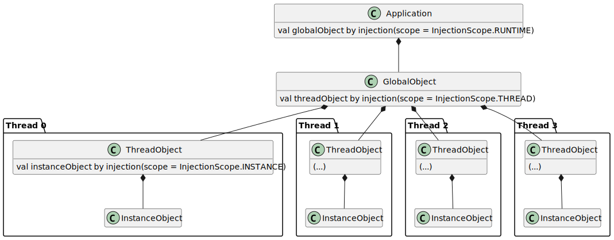

# Simple DI

A very simple library for dependency injection in Kotlin, using modern Kotlin features. Simple DI is:

- **Fast and efficient**: it only does what it's supposed to do, without hidden control flows or tricks for supporting
  features you won't ever use
- **Elegant**: inject what you need using Kotlin's delegated properties or constructors, without using ugly annotations
  everywhere
- **Usable**: it supports circular dependencies and multiple scopes of dependency injection (see below)
- **Easy to integrate**: simple DI comes with no extra dependency, which makes it extremely easy to integrate into any
  project, new or existing

## Installation

It is recommended to always use the latest Kotlin version when using Simple DI. However, you should be good when using
an older Kotlin release.

Simple DI is available on Maven Central. Add the dependency to your project:

**Gradle Kotlin**

```kt
implementation("dev.zodiia:simple-di:1.1.1")
```

**Gradle Groovy**

```groovy
implementation 'dev.zodiia:simple-di:1.1.1'
```

**Maven**

```xml
<dependency>
  <groupId>dev.zodiia</groupId>
  <artifactId>simple-di</artifactId>
  <version>1.1.1</version>
</dependency>
```

## Usage

To start injecting classes, simply use delegated properties with the `injection` method:

```kt
import dev.zodiia.simpledi.injection

class Foo {
  fun doSomething() {
    // doing something
  }
}

class Bar {
  val foo by injection<Foo>()

  fun doSomethingWithFoo() {
    foo.doSomething()
  }
}
```

Simple DI will also attempt to inject variables in the constructor:

```kt
class Foo {
  fun doSomething() {
    // doing something
  }
}

class Bar(val foo: Foo) {
  // some methods
}

class Baz {
  val bar by injection<Bar>()

  fun doSomethingWithFoo() {
    bar.foo.doSomething()
  }
}
```

Finally, you can also inject instances directly in methods (such as the main method):

```kt
class Foo {
  fun doSomething() {
    // doing something
  }
}

fun main() {
  val foo by injection<Foo>()

  foo.doSomething()
}
```

### Circular dependencies

Circular dependencies are supported by simple DI, as long as you don't use injected instances in constructors or `init`
blocks (this is considered undefined behavior, as it may only work if the requested instance was already available and
didn't need to be constructed).

This is due to the fact that dependencies are lazily injected, meaning when you inject an instance, it won't effectively
be requested (and eventually injected) until you use it for the first time.

Example:

```kt
class Foo {
  val bar by injection<Bar>()
  val i = 1

  fun printBarNumber() = println(bar.i)
}

class Bar {
  val foo by injection<Foo>()
  val i = 2

  fun printFooNumber() = println(foo.i)
}

fun main() {
  val foo by injection<Foo>()
  val bar by injection<Bar>()

  bar.printFooNumber() // prints "1"
  foo.printBarNumber() // prints "2"
}
```

If you absolutely need to use a circular dependency in a constructor, make sure there is at least one class in the
dependency circle that isn't using another one in its constructor.

### Scopes

To control what you're injecting and when, you can use different scopes.

If you do not provide any scope, the `RUNTIME` scope is used.

When injecting constructor parameters, the same scope as the one used to request the instance currently being
constructed will be used.

Here is a diagram explaining the different scope levels (excluding REQUEST, as its instance is never actually stored):



In this example, `ThreadObject` could actually use the THREAD scope as well to inject `InstanceObject`, although in
other cases the result will be different.

#### Runtime (`InjectionScope.RUNTIME`)

It will only ever inject one and only one instance of the requested type, for all classes requesting it.

In most cases, this is the scope you want to use.

Example:

```kt
class Foo {
  val rnd = Random().nextInt()
}

fun main() {
  val foo1 by injection<Foo>(InjectionScope.RUNTIME)
  val foo2 by injection<Foo>(InjectionScope.RUNTIME)

  println(foo1.rnd) // prints a random number
  println(foo2.rnd) // prints the same random number
}
```

#### Thread (`InjectionScope.THREAD`)

The instance that you are injecting will be a different one for each running thread.

From the same parent instance, you will be getting two different injected child instances if you are using the parent in
two different threads.

This scope can be used to inject classes that are thread-unsafe, for example, or to have different states with different
threads.

Example:

```kt
class Foo {
  val rnd = Random().nextInt()
}

fun main() {
  val foo by injection<Foo>(InjectionScope.THREAD)

  Thread {
      println(foo.rnd) // prints a random number
  }.start()
  Thread {
      println(foo.rnd) // prints a different random number than the first one
  }.start()
}
```

#### Instance (`InjectionScope.INSTANCE`)

The injected instance will be different for each parent instance.

This is a bit like instantiating it yourself, expect you get dependency injection for the constructor.

Warning: currently, if you try to inject the same type twice in the same class, you will get two different instances.
This is a known bug and will be fixed.

Example:

```kt
class Foo {
  val rnd = Random().nextInt()
}

class Bar {
  val foo by injection<InjectionScope.INSTANCE>()
}

fun main() {
  val bar1 = Bar()
  val bar2 = Bar()

  println(bar1.foo.rnd) // prints a random number
  println(bar2.foo.rnd) // prints a different random number than the first one
}
```

#### Request (`InjectionScope.REQUEST`)

A new instance will be injected every time you request it, that is every time you access the variable. Use it at your
own risk!

Example:

```kt
class Foo {
  val rnd = Random().nextInt()
}

fun main() {
  val foo by injection<Foo>(InjectionScope.REQUEST)

  println(foo.rnd) // prints a random number
  println(foo.rnd) // prints a different random number
  println(foo.rnd) // prints yet another random number
  // ...
}
```

### Multiple `ComponentMap`s

`ComponentMap`s are the main entry points for each injection request which scope is either RUNTIME or THREAD. It also
stores all component instances (hence its name) in the different scopes. An advanced use case could require the use of
different `ComponentMap`s in different context. This can be achieved pretty easily.

When injecting through class constructors, the same `ComponentMap` will be used for injecting the constructor
parameters, you do not need to do any additional work here.

When injecting using the `injection` delegated property, the method takes as second parameter a `ComponentMap`, which,
when specified, will be used for the injection instead of the global one. You can also retrieve the current
`ComponentMap` in which the current instance is by adding it to your constructor. For example:

```kt
class Foo(componentMap: ComponentMap) {
    val bar by injection(componentMap = componentMap)
}
```

In this example, `bar` will be injected using the same `ComponentMap` that was used to inject `Foo` in the first place.

## Getting help

If you need help, feel free to open a discussion in the discussion tab of the repository.

You can also reach out to me using my email address, [hey@zodiia.moe](mailto:hey@zodiia.moe?subject=Simple%20DI), or on
Discord, **zodiia**.

## Contributing

Feel free to send pull requests if you want to contribute by adding a small feature or fix a bug. However, please keep
in mind the spirit of this library: to be kept small and effective.

This project uses [detekt](https://github.com/detekt/detekt) to keep the code clean and readable.

## License

This library is released under the MIT license.

See [LICENSE](https://github.com/zodiia/simple-di/blob/main/LICENSE).
